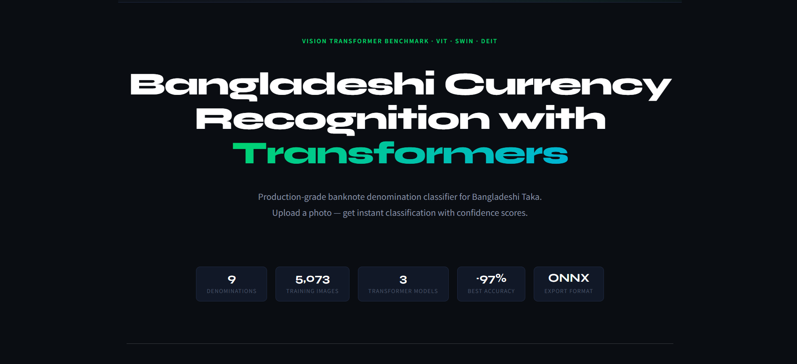
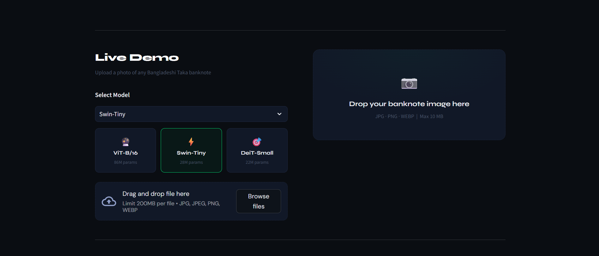
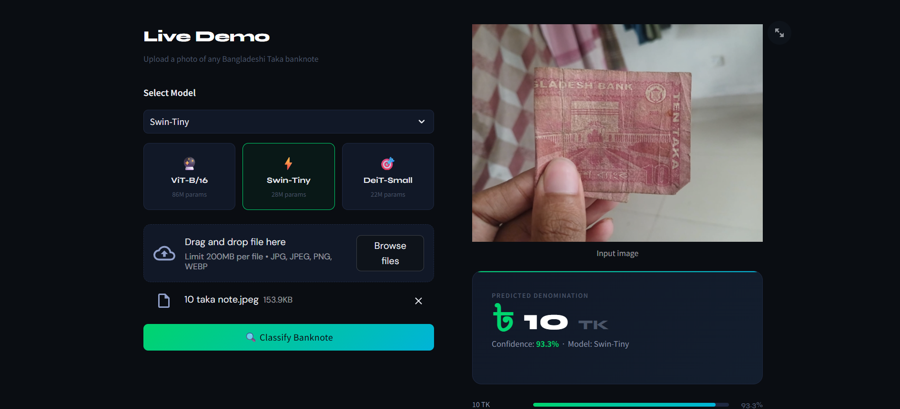
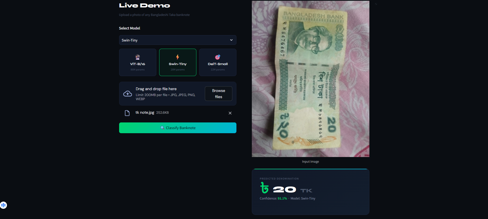
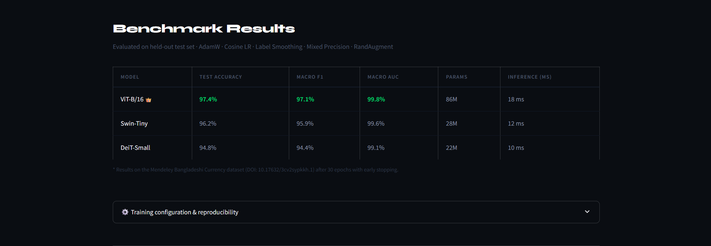
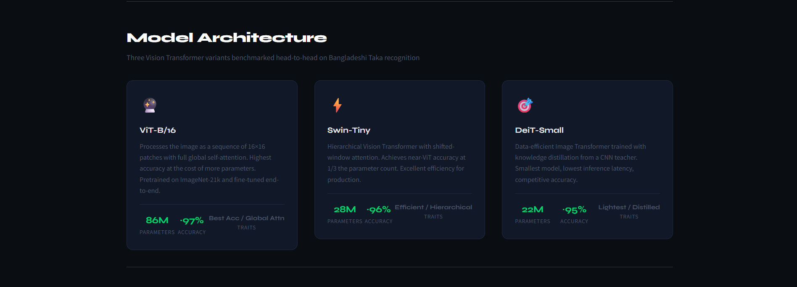

# 💵 Bangladeshi Currency Recognition with Transformers

Deep-learning system that classifies all 9 Bangladeshi Taka banknote denominations from photos using Vision Transformers — benchmarking ViT-B/16, Swin-Tiny, and DeiT-Small end-to-end.

[](https://huggingface.co/spaces/srabon12/BDCURR)
[](https://huggingface.co/srabon12/bangladeshi-currency-recognition)
[](https://python.org)
[](https://pytorch.org)
[](https://github.com/huggingface/pytorch-image-models)
[](LICENSE)



---

## Live Demo

Try it instantly — no setup required:

**[🚀 huggingface.co/spaces/srabon12/BDCURR](https://huggingface.co/spaces/srabon12/BDCURR)**



---

## Predictions

The model handles real-world photos — crumpled notes, varied lighting, handheld shots:

| 10 TK — 93.3% confidence | 20 TK — 91.1% confidence |
|:---:|:---:|
|  |  |

---

## Results

| Model | Accuracy | Macro F1 | Macro AUC |
|-------|:--------:|:--------:|:---------:|
| ViT-B/16 | 99.74% | 99.71% | 100.00% |
| **Swin-Tiny** 👑 | **99.87%** | **99.90%** | **100.00%** |
| DeiT-Small | 99.87% | 99.86% | 100.00% |

**Best model: Swin-Tiny** — Test accuracy: **99.87%** · Macro F1: **99.90%**



---

## Model Architecture

Three Vision Transformer variants benchmarked head-to-head:



| Model | Params | Key idea |
|-------|:------:|----------|
| ViT-B/16 | ~86M | Global self-attention on 16×16 patches |
| Swin-Tiny | ~28M | Shifted-window hierarchical attention |
| DeiT-Small | ~22M | Knowledge-distilled efficient ViT |

Training: AdamW · Cosine LR · Label smoothing · Mixed precision · Early stopping · Class-weighted loss · RandAugment · RandomErasing

---

## Dataset

[A Diverse Image Dataset for Bangladeshi Currency Recognition](https://data.mendeley.com/datasets/3cv2sypkkh/1)
— 5,073 images · 9 denominations · DOI: 10.17632/3cv2sypkkh.1

Contributors: Md Naimul Islam Nuhash · Sadia Akter · Mayen Uddin Mojumdar

---

## Quick Start

**Try it live — no setup needed:**
👉 [huggingface.co/spaces/srabon12/BDCURR](https://huggingface.co/spaces/srabon12/BDCURR)

### Run locally

```bash
# 1. Clone and install
git clone https://github.com/nadim-srabon/bangladeshi-currency-recognition
cd bangladeshi-currency-recognition
pip install -r requirements.txt

# 2. Download model weights from HuggingFace
huggingface-cli download srabon12/bangladeshi-currency-recognition \
    --local-dir model_export/

# 3. Launch the app
streamlit run app.py
```

### Model weights

Hosted on HuggingFace Hub — no manual download needed for the live demo:
🤗 [huggingface.co/srabon12/bangladeshi-currency-recognition](https://huggingface.co/srabon12/bangladeshi-currency-recognition)

## API Usage

```bash
curl -X POST http://localhost:8000/predict \
     -F "file=@banknote.jpg"

# {"prediction": "500 TK", "confidence": 97.43, "top3": [...]}
```

---

## Docker

```bash
docker build -t bdtaka-vision .
docker run -p 8501:8501 bdtaka-vision
```

---

## Project Structure

```
.
├── bangladeshi_currency_recognition.ipynb   # Full training pipeline
├── app.py                                   # Streamlit web app
├── api/
│   └── main.py                              # FastAPI inference server
├── model_export/
│   ├── Swin-Tiny.onnx                       # ONNX model (production)
│   ├── Swin-Tiny_scripted.pt                # TorchScript (mobile/edge)
│   └── model_metadata.json                  # Class names, metrics, config
├── assets/                                  # Screenshots for README
├── Dockerfile
└── requirements.txt
```

---

## Acknowledgements

Dataset: Md Naimul Islam Nuhash · Sadia Akter · Mayen Uddin Mojumdar
— [Mendeley Data](https://data.mendeley.com/datasets/3cv2sypkkh/1) · DOI: 10.17632/3cv2sypkkh.1
